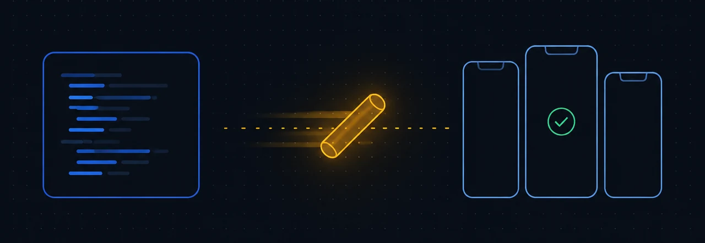
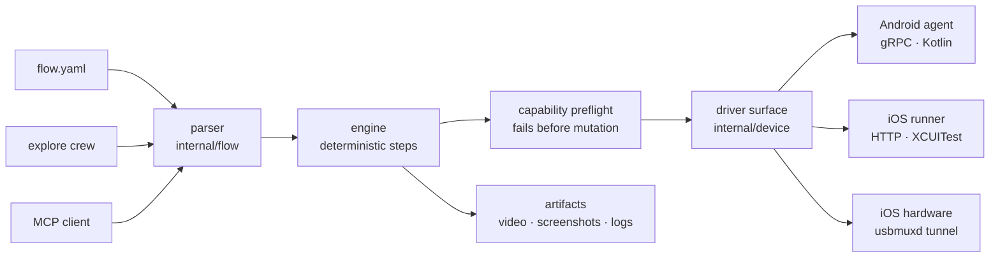

<div align="center">

# FlowBaton

**Mobile UI tests that fail only when your app breaks.**

One Go binary drives Android devices, iOS Simulators, and physical iPhones
from plain YAML — or explores your app with an AI crew and writes the flows
itself. No server process, no JVM, no device cloud.

[](https://github.com/larchwave/flowbaton/actions/workflows/ci.yml)
[](https://github.com/larchwave/flowbaton/releases)
[](https://goreportcard.com/report/github.com/larchwave/flowbaton)
[](LICENSE)

[Install](#install) · [Quick start](#quick-start) · [How it works](#how-it-works) · [Flow commands](#flow-command-surface) · [CLI](#cli-surface) · [Docs](#documentation)



</div>

---

```yaml
appId: com.example.app
---
- launchApp
- tapOn: "Log in"
- inputText: "demo@example.com"
- tapOn: "Continue"
- assertVisible: "Welcome back"
```

```sh
flowbaton test -p ios --device <simulator-udid> login.yaml
```

The same file runs unchanged on an Android emulator, a physical iPhone, or a
`serve` cluster.

## Table of contents

- [Install](#install)
- [Quick start](#quick-start)
- [How it works](#how-it-works)
- [Flow command surface](#flow-command-surface)
- [CLI surface](#cli-surface)
- [Let it explore](#let-it-explore)
- [Use it from a coding agent](#use-it-from-a-coding-agent)
- [Run a fleet](#run-a-fleet)
- [Design rules](#design-rules)
- [Platform support](#platform-support)
- [Status](#status)
- [Documentation](#documentation)
- [Community](#community)

## Install

```sh
brew tap larchwave/flowbaton
brew trust larchwave/flowbaton
brew install flowbaton
```

<details>
<summary>Go, archives, and Windows</summary>

From source (a source build reports its version as `dev`):

```sh
go install github.com/larchwave/flowbaton/cmd/flowbaton@latest
```

Archives for macOS, Linux, and Windows are on the
[releases page](https://github.com/larchwave/flowbaton/releases). Every archive
carries SLSA provenance you can verify yourself:

```sh
gh attestation verify flowbaton_*_darwin_arm64.tar.gz --repo larchwave/flowbaton
```

On Windows, download `flowbaton_<version>_windows_amd64.zip`, extract it, and
put the extracted folder on `PATH`.

</details>

## Quick start

Parse and diagnose a flow with no device attached:

```sh
printf 'appId: com.example.app\n---\n- tapOn: "Continue"\n' | flowbaton check-syntax -
```

Prepare a platform driver once, then run flows:

```sh
flowbaton driver-setup -p android
flowbaton test -p android --device emulator-5554 path/to/flow.yaml
```

<details>
<summary>iOS Simulator</summary>

Needs Xcode and an installed Simulator runtime.

```sh
flowbaton driver-setup -p ios
flowbaton test -p ios --device <simulator-udid> path/to/flow.yaml
```

Find a booted Simulator's UDID with `xcrun simctl list devices booted`.

</details>

<details>
<summary>Physical iPhone or iPad (iOS 17+)</summary>

Build the device runner once — this needs Xcode with a signed-in Apple ID (a
free account works, with 7-day profiles) — then run flows over USB. No sudo,
no extra daemons.

```sh
export FLOWBATON_IOS_TEAM=<your team id>   # Xcode > Settings > Accounts
scripts/build-ios-device-runner.sh
flowbaton test -p ios --device <device-udid> path/to/flow.yaml
```

`flowbaton list-devices -p ios` shows attached hardware alongside Simulators;
the same `-p ios` picks the right driver from the UDID.

</details>

Ready-made flows that run against the stock Android Settings app — no app to
build — live in
[flowbaton-samples](https://github.com/larchwave/flowbaton-samples).

<p align="center">
  
  <br>
  <sub>One of those sample flows, captured with <code>flowbaton record</code>.</sub>
</p>

## How it works

One process. The YAML is parsed into an AST, compiled into deterministic
steps, and pushed at a platform-neutral driver surface. The on-device drivers
ship inside the same binary and speak frozen, machine-readable wire contracts.



Four properties fall out of that shape:

- **The flows the AI writes are the flows you run.** Exploration exports
  through the same parser that executes handwritten YAML, so a generated test
  is valid by construction.
- **Nothing mutates a half-configured device.** `internal/capability` runs
  side-effect-free preflight checks and fails the run first.
- **An upgrade cannot quietly change what `tapOn` matches.** Selector
  semantics are pinned by tests, and the host/driver contracts in
  `contracts/` are frozen and hash-pinned.
- **The AI is a caller, not a layer.** Strip the provider key and the engine
  is unchanged.

## Flow command surface

55 commands, one grammar, every platform.

| Group | Commands |
| --- | --- |
| **App lifecycle** | `launchApp` `stopApp` `killApp` `clearState` `clearKeychain` `setPermissions` `applyConfiguration` |
| **Touch and gestures** | `tapOn` `doubleTapOn` `longPressOn` `swipe` `scroll` `scrollUntilVisible` `back` `pressKey` `waitForAnimationToEnd` |
| **Text** | `inputText` `eraseText` `pasteText` `hideKeyboard` `copyTextFrom` `setClipboard` `inputRandomText` `inputRandomNumber` `inputRandomEmail` `inputRandomPersonName` `inputRandomCityName` `inputRandomCountryName` `inputRandomColorName` |
| **Assertions** | `assertVisible` `assertNotVisible` `assertTrue` `assertScreenshot` |
| **AI assertions** | `assertWithAI` `assertNoDefectsWithAI` `extractTextWithAI` |
| **Device state** | `setLocation` `travel` `setOrientation` `setAirplaneMode` `toggleAirplaneMode` `openLink` `openBrowser` `addMedia` |
| **Capture** | `takeScreenshot` `startRecording` `stopRecording` |
| **Control flow** | `runFlow` `repeat` `retry` `extendedWaitUntil` `defineVariables` `action` |
| **Scripting** | `runScript` `evalScript` |

Text typed into a secure field is exported as a
`${FLOWBATON_…SECRET…}` placeholder. The engine fails the flow when the
variable is unset, and keeps the placeholder — never the resolved value — in
recordings, artifacts, and replays.

## CLI surface

| Command | What it does |
| --- | --- |
| `check-syntax` | Parse a flow and print source diagnostics. No device. |
| `test` | Run flows on a device, an emulator, or a Simulator. |
| `record` | Run one flow and render a video of it. |
| `explore` | Autonomous AI session that drives the app and exports flows. |
| `list-devices` | Inventory devices and Simulators. Reads only. |
| `start-device` | Boot an emulator or Simulator, optionally creating it. |
| `hierarchy` | Dump what is on screen. Taps nothing, changes nothing. |
| `query` | Match a selector expression against the live screen. |
| `bugreport` | Collect a device diagnostic bundle. |
| `driver-setup` | Install the signed, version-matched platform driver. |
| `mcp` | Serve the MCP tool surface to a coding agent. |
| `serve` | Multi-node DeviceSession runtime backed by PostgreSQL. |
| `db` | Apply the `serve` runtime schema. |
| `auth` | Keys and certificate mapping for `serve`. |
| `generate-completion` | bash or zsh completion script. |

Run `flowbaton` with no arguments to print the command summary.

## Let it explore

Give FlowBaton a provider key and it tests your app on its own:

```sh
export OPENAI_API_KEY=...   # or ANTHROPIC_API_KEY with FLOWBATON_AI_PROVIDER=anthropic
flowbaton explore --app com.example.app -p ios --device <simulator-udid>
```

A crew of models maps each screen, plans test scenarios, taps through them on
the live device, and judges the outcomes. The session ends with a written
report, and every passing run is exported as flow YAML — a test the crew finds
is a test you commit.

| | |
| --- | --- |
| **Bounded** | `--max-tests` and `--max-steps` cap every session. `--pilot` adds a supervisor model that stops a runaway one. |
| **Recorded** | The crew acts only through a fixed device toolbox; every step and its effect on the screen is captured. `--record` adds video. |
| **Remembering** | Per-app memory carries screen maps, plans, and operator hints into the next session. |
| **Yours** | Your key, your models, no telemetry. Without a key, explore refuses to start rather than degrading quietly. |

## Use it from a coding agent

FlowBaton ships an MCP server inside the same binary:

```sh
flowbaton mcp
```

Point your agent's MCP configuration at that command and it gets
`check_syntax`, `list_devices`, `start_device`, `hierarchy`, `query`,
`run_flow`, `screenshot`, and `explore` against connected devices and
Simulators — enough to boot a device, drive a flow, read the screen, and kick
off an autonomous session. `AGENTS.md` gives agents a short tour of the CLI
and the flow shape.

## Run a fleet

`flowbaton serve` runs the same flows as a multi-node runtime, with PostgreSQL
holding every lease, token, and work claim. Device sessions survive
reconnects and cancel cleanly.

```sh
flowbaton db apply-schema --database-url "$FLOWBATON_DATABASE_URL"
```

A node then serves Integration v1 and DeviceSession v1 over mutual TLS. The
full flag set — certificates, signing keys, node ID, device inventory — is in
[Remote DeviceSession runtime](docs/remote-runtime.md).

## Design rules

- **One static binary.** The Go host and the on-device drivers ship together.
  Nothing else to install, no background server to babysit.
- **Deterministic on purpose.** Frozen wire contracts in `contracts/`,
  hash-pinned driver artifacts, selector semantics pinned by tests.
- **Preflight before mutation.** An unsupported capability fails the run
  before FlowBaton touches your device.
- **AI is optional and yours.** Bring your own key. Without one, AI commands
  fail closed instead of silently degrading. No telemetry either way.
- **Auditable releases.** Archives are built by a pinned least-privilege CI
  workflow and ship SLSA provenance.

## Platform support

| Host | Android | iOS Simulator | iOS device (17+) |
| --- | --- | --- | --- |
| macOS arm64 / amd64 | works | works | hardening |
| Linux amd64 | works | unavailable | hardening<sup>1</sup> |
| Windows amd64 | pre-alpha<sup>2</sup> | unavailable | hardening<sup>1</sup> |

<sup>1</sup> Needs usbmuxd (macOS ships it). The device runner is built once on
macOS with Xcode; running an already-built runner works from any host.
<sup>2</sup> Flow parsing and syntax checks work; Android execution has not yet
passed the release gates.

Two operations stay unsupported on physical iOS hardware because Apple locks
them for every automation tool without a jailbreak: `clearKeychain` and
`addMedia`. They fail before device mutation and report `false` in the driver
capability document. Full detail in the
[support matrix](docs/support-matrix.md).

## Status

FlowBaton is pre-alpha. Android devices and emulators plus iOS Simulators work
today; physical iOS devices, autonomous exploration, the multi-node runtime,
and web execution are newly landed and hardening.

The released archives do not yet carry the newest features: until the next
tag, `explore`, the `start_device` / `run_flow` / `screenshot` MCP tools, and
the physical-iOS driver need a source build (`go install` above).

Command surface and contracts are versioned; expect breaking changes between
pre-1.0 releases.

## Documentation

| | |
| --- | --- |
| [Development plan](PLAN.md) | Where this is going. |
| [Support matrix](docs/support-matrix.md) | What runs where, and what does not. |
| [Remote DeviceSession runtime](docs/remote-runtime.md) | `flowbaton serve`, leases, tokens. |
| [Release policy](docs/release-policy.md) | Versioning and release gates. |
| [Dependency policy](docs/dependency-policy.md) | What may enter the build. |
| [Security policy](SECURITY.md) | Reporting a vulnerability. |
| [Contributing](CONTRIBUTING.md) | Build from source, platform checks. |

Machine-readable API contracts live in `contracts/`. Normative product
behavior is specified in `specs/`.

## Community

- Questions and ideas: [GitHub Discussions](https://github.com/larchwave/flowbaton/discussions)
- Bugs: [issues](https://github.com/larchwave/flowbaton/issues)

If FlowBaton is useful to you, star the repository — it helps other people
find it.

## License

FlowBaton is licensed under the [Apache License 2.0](LICENSE). Third-party
components and their licenses are listed in
[THIRD_PARTY_NOTICES.md](THIRD_PARTY_NOTICES.md).
